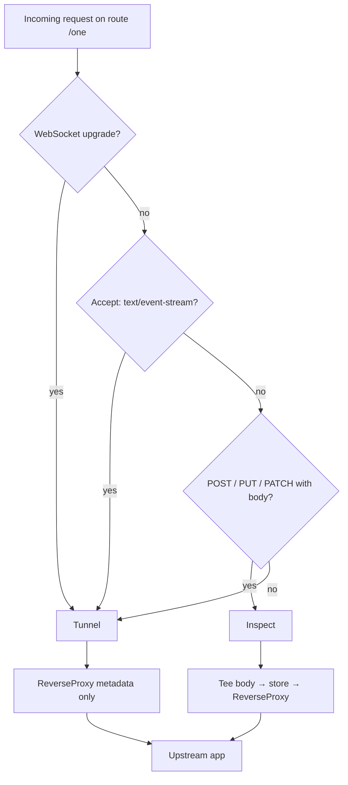

# funneltap: proxy and streaming plan

## Summary

Refactor the intercept server so funneltap can **inspect webhooks** and **proxy everything else** on the same route — without per-sub-path configuration.

Today funneltap buffers every request body and applies a 30s timeout to the full upstream round trip. That works for webhooks but breaks SSE, WebSockets, and long-lived HTTP. The fix is a **per-request dual-mode proxy**: capture webhook-style traffic; tunnel streaming traffic transparently.

**Not the goal:** recording SSE event streams or WebSocket message payloads. Those are out of scope. The goal is to **not break** apps that mix webhooks and live connections behind one funnel mount.

## Goals

- One route (e.g. `/one`) can serve mixed sub-paths: `/one/hooks` (inspect) and `/one/ws` (tunnel) with no extra config.
- Preserve bit-identical request body capture for webhook-style requests (HMAC verification).
- Support SSE, WebSockets, and unlimited-duration streams in tunnel mode.
- Match Tailscale Funnel behavior on the localhost hop (stream bodies, no global round-trip timeout).
- Show accurate proxy state in API/UI for in-flight and completed connections.

## Non-goals

- Response body capture (especially for streams).
- TLS termination, public DNS, bandwidth caps (Tailscale handles these).
- URL/method-based signatures that depend on the original public path (e.g. AWS SigV4).
- Persistent store beyond the in-memory ring buffer.
- Per-route or per-sub-path `inspect` toggles as the primary UX (see [Per-request classification](#per-request-classification)).

---

## Problem today

```text
Internet → Tailscale Funnel → funneltap intercept → your app
```

`internal/intercept/handler.go` currently:

1. `io.ReadAll` on the full request body before forwarding.
2. `http.Client.Do` with `Timeout: PROXY_TIMEOUT` (default 30s) on the **entire** round trip.
3. Copies response headers + `io.Copy` body.

| Traffic | What breaks |
|---------|-------------|
| Webhooks (POST, small body) | Works; bodies are bit-identical for HMAC |
| SSE | Killed by 30s timeout |
| WebSocket | No upgrade/hijack; `101` does not become a tunnel |
| Long polling | Killed by 30s timeout |

Webhook capture is correct. The proxy layer is not.

---

## Target behavior

### One route, mixed sub-paths

User mounts a single route:

```text
/one → http://localhost:3000
```

Traffic under that mount is classified **per request**:

```text
POST /one/hooks/github     → inspect  (capture body, show in UI)
POST /one/api/orders       → inspect  (capture body)
GET  /one/ws               → tunnel   (WebSocket upgrade)
GET  /one/events           → tunnel   (SSE)
GET  /one/poll             → tunnel   (long-lived GET, no body)
```

No separate funnel mount. No `inspect: false` on the route. Sub-path behavior follows request shape.

### Two modes

| Mode | Purpose | Body capture | Connection |
|------|---------|--------------|------------|
| **Inspect** | Webhook debugging & HMAC verification | Full request body (tee while forwarding) | Unlimited; body limited by `MAX_BODY_BYTES` (funneltap memory only) |
| **Tunnel** | Pass-through for live/streaming traffic | None (metadata only: method, path, headers) | Unlimited until client or upstream closes |



### Why implement WS/SSE without response capture?

funneltap sits in the proxy path. Real apps combine:

- `/hooks/*` — need inspection
- `/ws`, `/events` — need to **work**, not be recorded

Without tunnel mode, users must bypass funneltap or add a second funnel mount. Tunnel mode is an **obligation as a proxy**, not a new inspection feature.

---

## Per-request classification

Default rules (no user configuration):

| Condition | Mode |
|-----------|------|
| `Connection: Upgrade` and `Upgrade: websocket` (case-insensitive) | tunnel |
| `Accept` contains `text/event-stream` | tunnel |
| `POST`, `PUT`, or `PATCH` with `Content-Length > 0` or chunked body | inspect |
| `GET`, `HEAD`, `OPTIONS`, `DELETE` (no request body) | tunnel (metadata only) |

### Edge cases

| Case | Behavior |
|------|----------|
| GET webhook verification (no body) | tunnel/metadata — headers and path still logged; nothing to HMAC |
| POST with empty body | inspect with empty stored body |
| Body over `MAX_BODY_BYTES` | `413` before upstream forward (inspect mode only) |
| Ambiguous long GET (not SSE, not WS) | tunnel by default — safe for long poll; no body to capture anyway |

### Optional override (low priority)

Per-route `inspect: false` may be added later as a **power-user escape hatch** for unusual traffic (e.g. binary POST streams that must not be buffered). It is **not** part of the primary UX and does not solve sub-path mixing — classification handles that.

---

## Timeouts

**Design principle:** funneltap forwards requests. Whether the upstream responds, how fast, or at all is not funneltap's job to judge. No proxy-side timeouts on dial, headers, or response body.

| Concern | funneltap behavior |
|---------|-------------------|
| Upstream slow or silent | Request stays open; UI shows pending/streaming until client or upstream closes |
| Upstream never responds | Same — not funneltap's problem; the caller (Stripe, browser) has its own timeouts |
| Client disconnects | Cancel upstream via `r.Context()` — stop forwarding when the inbound side is gone |
| Inspect body too large | `MAX_BODY_BYTES` — limits funneltap's capture buffer, not upstream behavior |

**Remove `PROXY_TIMEOUT`** (and do not add `PROXY_HEADER_TIMEOUT`). The current global `http.Client{Timeout}` is what breaks SSE/WebSockets; `ReverseProxy` with a default `Transport` and no client timeout replaces it.

Streams, slow webhooks, and hung upstreams all behave the same: forward until something closes the connection.

---

## Architecture

```text
Internet
  → tailscale funnel (--set-path /one)
  → intercept server (127.0.0.1:PORT)
  → per-request classifier
  → httputil.ReverseProxy
  → upstream target
```

Inspect path uses `io.TeeReader` so bytes forwarded upstream equal bytes stored (HMAC invariant preserved).

Tunnel path uses `ReverseProxy` directly; store records connection metadata only.

---

## Implementation phases

### Phase 1 — ReverseProxy (no proxy timeouts)

**Unlocks:** SSE, long polling, correct Host/query forwarding; removes the 30s round-trip kill.

**Changes:**

- Replace hand-rolled `http.Client` loop in `internal/intercept/handler.go` with `httputil.ReverseProxy`.
- No `http.Client.Timeout`, no `ResponseHeaderTimeout`, no dial timeout on the proxy `Transport` — funneltap does not cut off upstream.
- Remove `PROXY_TIMEOUT` from `internal/config/config.go` and `README.md`.
- `Rewrite`: set upstream URL via `routes.BuildUpstreamURL`, preserve `RawQuery`, set `Host` to upstream host.
- Propagate client disconnect: upstream request uses `r.Context()`.

**Tests:**

- SSE: upstream streams events for 60s+; client receives them (would fail today with `PROXY_TIMEOUT`).
- Long GET: upstream holds response 60s+ before body; funneltap does not abort.
- Unreachable localhost upstream: fast `connection refused` from OS (no funneltap timeout needed).

---

### Phase 2 — Per-request classifier + tunnel path

**Unlocks:** WebSockets; mixed `/one/hooks` + `/one/ws` on one route.

**Changes:**

- Add `internal/intercept/mode.go` with `Classify(r *http.Request) Mode`.
- `ServeHTTP` branches to inspect or tunnel handler (shared `ReverseProxy` instance).
- Tunnel: `Store.Add` with empty body; metadata-only entry.
- WebSocket: rely on `ReverseProxy` upgrade handling (Go 1.12+); preserve `RawQuery`; do not buffer upgrade body.

**Tests:**

- WebSocket echo through intercept; query string preserved.
- Same route: POST → body in store; WS upgrade → no body, connection works.
- SSE `Accept` header triggers tunnel on a POST-less GET.

---

### Phase 3 — Tee-based inspect capture

**Unlocks:** Start forwarding before full body read; keep HMAC parity.

**Changes:**

- Inspect path: wrap `r.Body` with `io.LimitReader` + `io.TeeReader` into a per-request buffer.
- `Store.Add` early (pending); `Store.FinalizeBody(id, body)` when request side completes.
- Forward tee reader as request body to `ReverseProxy`.

**Tests:**

- Existing `TestHandlerRecordsAndProxies` — body bytes unchanged.
- Large body at `MAX_BODY_BYTES` boundary → `413`.
- Concurrent requests use isolated buffers.

---

### Phase 4 — Streaming proxy metadata + UI

**Unlocks:** Visible open connections; elapsed time while open; final duration on close.

#### Server / store

- Extend `store.ProxyInfo`:

  ```go
  type ProxyInfo struct {
      Status     int
      DurationMs int64
      Error      string
      Streaming  bool
      ClosedAt   *time.Time
  }
  ```

- Tunnel/stream: set `Streaming: true` on start; set `Streaming: false`, final `DurationMs`, and `ClosedAt` **only when the connection closes** (wrap `ResponseWriter` or use context cancel).
- Do **not** update `DurationMs` every second while a stream is open.
- API: pass through new fields (additive JSON). `receivedAt` on the request is enough for live elapsed display.

#### UI — list

- Streaming rows: `data-streaming="true"` and `data-received-at` on the list item; status class `status-streaming`.
- Label: `streaming · Ns` where `N = floor((Date.now() - receivedAt) / 1000)` — computed **client-side**, not from the server.
- `tickStreamingLabels()` updates status text on all `[data-streaming="true"]` rows. Called at the end of the existing 1s `poll()` loop (no second timer, no per-tick API call).
- Rename/extend `refreshPending()` → `refreshActive()`: re-fetch list entries that are **pending** or **streaming**, to detect when `streaming` flips to false.

#### UI — detail pane (click a streaming request)

- Click behaves as today: `loadDetail(id)` → `GET /requests/{id}` → `renderDetail(req)` once.
- While `proxy.streaming`:
  - Status shows `streaming · Ns` (same client clock as the list).
  - Headers section: request headers as captured (e.g. `Upgrade`, `Accept`).
  - Body section: “Not captured (streaming connection)” — no `bodyBase64` for tunnel traffic.
- `tickStreamingLabels()` also updates `.detail-status` when the selected row is streaming — **text only**, no full re-render.
- Do **not** call `loadDetail` every second while streaming.
- When the stream closes: `refreshActive()` sees `streaming: false` → `updateListItem` + **one** `loadDetail(id)` for final status and `durationMs`.

#### UI — when stream ends

- List label switches from `streaming · Ns` to final form (e.g. `200 · 45230ms`).
- Detail (if open) shows final status after the single reload.

**Tests:**

- API returns `streaming: true` while SSE connection open; `streaming: false` and final `durationMs` after close.
- Manual: list and detail elapsed tick in sync; no flicker; detail reloads once on close.

---

### Phase 5 — Optional per-route override (defer)

Only if real cases appear that classification cannot handle. Not required for `/one` + `/one/ws` scenario.

---

## File touch list

| File | Phase | Changes |
|------|-------|---------|
| `internal/intercept/handler.go` | 1–3 | ReverseProxy, classifier dispatch, tee, hooks |
| `internal/intercept/mode.go` | 2 | New: `Classify`, helpers |
| `internal/intercept/handler_test.go` | 1–3 | SSE, WS, mixed route, long-hold tests |
| `internal/config/config.go` | 1 | Remove `PROXY_TIMEOUT` |
| `internal/store/store.go` | 3–4 | `FinalizeBody`, `ProxyInfo` streaming fields |
| `internal/api/api.go` | 4 | Pass through `ProxyInfo` fields |
| `internal/api/ui/app.js` | 4 | Streaming labels and styles |
| `README.md` | 1 | Env docs, streaming support note |
| `scripts/test-streaming-backend/` | test | Minimal upstream: `/test`, `/sse`, `/ws` |
| `scripts/test-proxy-streaming.sh` | test | Integration script + API assertions |

---

## Suggested order

```text
Phase 1 (ReverseProxy, no proxy timeouts)
    → Phase 2 (classifier + tunnel)     ─┐
    → Phase 3 (tee inspect)               ├→ Phase 4 (store + UI)
```

Phases 2 and 3 can run in parallel after Phase 1.

---

## How to test

After all phases are implemented, verify behavior with a small test backend and the funneltap API. Automated unit tests in `handler_test.go` cover regressions; this section is the **manual integration pass** that proves inspect vs tunnel end-to-end.

### Test backend

`scripts/test-streaming-backend/` is a minimal upstream with three routes on one port:

| Route | Method | Purpose | Expected funneltap mode |
|-------|--------|---------|-------------------------|
| `/test` | `POST` | Echo JSON body | **inspect** — body captured |
| `/sse` | `GET` | `text/event-stream`, one event per second (`?count=N`) | **tunnel** — stream through, no body |
| `/ws` | `GET` (upgrade) | WebSocket echo | **tunnel** — bidirectional relay, no body |

Start it:

```bash
go run ./scripts/test-streaming-backend -addr 127.0.0.1:9876
```

### Setup funneltap

1. Start funneltap and note `PORT` (intercept) and `API_PORT` (default 9000).
2. Add **one route** that covers all sub-paths:

```bash
curl -sS -X POST http://127.0.0.1:9000/routes \
  -H 'Content-Type: application/json' \
  -d '{"path":"/one","target":"127.0.0.1:9876"}'
```

Traffic flows: `intercept /.ft/one/test` → upstream `/test`, same for `/sse` and `/ws`.

### Run the integration script

```bash
PORT=<intercept-port> ./scripts/test-proxy-streaming.sh
```

The script:

1. Starts the test backend (if not already running).
2. Sends `POST /.ft/one/test` with `{"hello":"world"}`.
3. Opens `GET /.ft/one/sse?count=3` and prints events.
4. Opens WebSocket `/.ft/one/ws`, sends `ping`, expects `echo:ping`.
5. Queries `GET /requests` and `GET /requests/{id}` and asserts API shape.

### Expected API results

#### `POST /test` (inspect)

```bash
curl -sS http://127.0.0.1:9000/requests | jq '.[] | select(.path|startswith("/test")) | .id' | head -1
curl -sS http://127.0.0.1:9000/requests/<id> | jq '{method, path, bodyBase64, proxy}'
```

| Field | Expected |
|-------|----------|
| `method` | `POST` |
| `path` | `/test` |
| `bodyBase64` | decodes to `{"hello":"world"}` (bit-identical) |
| `proxy.streaming` | `false` |
| `proxy.status` | `201` (or upstream status) |
| `proxy.durationMs` | set after response completes |

#### `GET /sse` (tunnel)

| Field | Expected |
|-------|----------|
| `method` | `GET` |
| `path` | `/sse` or `/sse?count=3` |
| `bodyBase64` | empty / absent |
| `proxy.streaming` | `true` while stream open; `false` after close |
| `proxy.status` | `200` after stream ends |
| `proxy.durationMs` | reflects full stream lifetime |

While the stream is open, the UI list shows `streaming · Ns` (client-side tick). Detail pane: headers visible, body shows “Not captured (streaming connection)”.

#### `GET /ws` (tunnel)

| Field | Expected |
|-------|----------|
| `method` | `GET` |
| `path` | `/ws` |
| `bodyBase64` | empty / absent |
| `proxy.streaming` | `true` during connection; `false` after close |
| `proxy.status` | `101` or final status after close |

WebSocket messages are **not** in the API — only connection metadata.

### Manual checks (optional)

- **Long SSE:** `curl -N "http://127.0.0.1:$PORT/.ft/one/sse?count=60"` — must not be killed by funneltap mid-stream.
- **UI:** open `http://127.0.0.1:9000/ui/` during SSE; confirm list + detail status tick together.
- **Mixed route:** all three requests appear under the same route `/one` with no per-path config.

### When to run

Run this script **after each phase** that touches proxy behavior:

| After phase | Script should pass |
|-------------|-------------------|
| Phase 1 | SSE completes; POST still works (body capture may still buffer) |
| Phase 2 | WebSocket echo works; SSE + WS have no `bodyBase64` |
| Phase 3 | POST `bodyBase64` still bit-identical |
| Phase 4 | `proxy.streaming` + UI tick behave as above |

If the script fails or any API field does not match the [expected results](#expected-api-results) above, **fix the code and run the script again** — repeat until everything passes and you can confirm the behavior matches the plan. Do not move on to the next phase while this integration check is red.

### After each phase

When a phase passes the integration script and matches the expected API/UI behavior for that phase:

1. **Commit** the files touched in that phase (see [file touch list](#file-touch-list)). Include tests, script changes, and doc updates made for the phase — not unrelated work.
2. Use the repo commit style: `{type}: {description}` (e.g. `feat: add ReverseProxy without proxy timeouts`).
3. Start the next phase only after the commit is in place.

Example flow for Phase 1:

```text
implement → go test ./... → ./scripts/test-proxy-streaming.sh → fix until green → git add <phase-1 files> → git commit
```

Repeat the same loop (implement → test → fix → commit) for Phases 2–4.

---

## Verification checklist

- [ ] `./scripts/test-proxy-streaming.sh` passes with `PORT` set (POST inspect, SSE + WS tunnel API checks).
- [ ] SSE stream runs 60s+ without funneltap killing it.
- [ ] Slow upstream (60s+ to first byte) is not aborted by funneltap.
- [ ] WebSocket bidirectional messages work; query params reach upstream.
- [ ] HMAC verification from stored body still matches upstream-received bytes.
- [ ] UI list shows client-ticked `streaming · Ns` while open; final duration on close.
- [ ] Detail pane: headers visible, body shows “not captured”, status ticks with list; reloads once when stream ends.

---

## Risks and mitigations

| Risk | Mitigation |
|------|------------|
| Tee buffer races | Per-request buffer; no shared state |
| Misclassified POST as inspect when it should tunnel | Rare; defer per-route override to Phase 5 |
| `ReverseProxy` WebSocket edge cases | Integration tests; preserve `RawQuery` |
| UI poll load during many open streams | Elapsed time is client-side (`tickStreamingLabels`); poll only detects close via `refreshActive` |

---

## Bottom line

Use **per-request classification** so one route handles webhooks and live sub-paths together. **Inspect** preserves funneltap's core value (webhook capture + HMAC). **Tunnel** fulfills the proxy obligation (SSE/WebSocket/long connections, unlimited duration). Response body capture stays out of scope.
