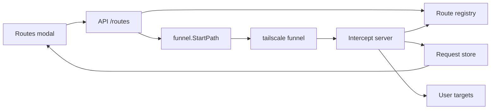

# funneltap: path-based routes plan

## Summary

Replace the single `--target` + auto-funnel-on-start model with **path-based routes** managed from the UI. Each route maps a funnel mount path to an upstream target. Traffic is captured by the intercept server, logged when it matches a route, and proxied upstream. Unmatched traffic returns 404 and is not stored or shown.

## Goals

- No funnel on startup (until routes exist or are recovered).
- Add/delete routes from a **Routes** modal in the UI.
- Each route runs `tailscale funnel --bg --set-path <path> <intercept-url>`.
- Tag requests visually and filter by route/target.
- Graceful shutdown tears down funnel mounts and removes the recovery file.
- Crash recovery via an on-disk checkpoint, with user confirmation.

## Non-goals (v1)

- Public UI access (API/UI stays local on `localhost:9000` or `API_PORT`).
- Persistent config files per project (may come later).
- Editing routes in place (delete + re-add).
- Overlapping route paths.

---

## Architecture

```text
Internet
  → tailscale funnel (--set-path /hooks)
  → intercept server (127.0.0.1:PORT)
  → route table lookup
  → upstream target (e.g. http://localhost:3000)
```

**Important:** The user enters an **upstream target** in the UI. The funnel command always points at the **intercept server**, not the upstream target directly. Otherwise funneltap would not capture requests.

Tailscale strips the mount prefix before forwarding to the intercept server (e.g. mount `/hooks`, request `/hooks/github` → intercept sees `/github`).



---

## Startup

1. Load config (no `--target`).
2. Start intercept server on `127.0.0.1:PORT` (`PORT` env or random ephemeral port).
3. Start API server on `0.0.0.0:9000` (or `API_PORT`).
4. **Do not** start funnel.
5. If crash-recovery file exists → show recovery prompt in UI (see [Crash recovery](#crash-recovery)).
6. Otherwise: empty route table, empty request list.

---

## Routes

### Data model

Each route (in memory at runtime):

| Field | Description |
|-------|-------------|
| `id` | Stable identifier (e.g. UUID) |
| `path` | Mount path (e.g. `/hooks`) |
| `target` | Normalized upstream URL |
| `publicURL` | Display only: `https://<machine>.<tailnet>.ts.net<path>` |

### Validation

- Path must start with `/`.
- Normalize trailing slashes: `/hooks` and `/hooks/` are equivalent.
- **No overlapping paths:** reject if the new path is a prefix of an existing path or vice versa (e.g. cannot add `/api` if `/api/v2` exists).
- Parse and normalize target (see [Target parsing](#target-parsing)).

### Add route

1. Validate path and target.
2. Run `tailscale funnel --bg --set-path <path> <intercept-port>` (bare port → localhost).
3. On funnel failure: show error in modal, do not persist route.
4. On success: store route in memory, write crash-recovery file.

### Delete route

1. Run funnel teardown for that mount (equivalent to `tailscale funnel --set-path <path> off`).
2. Remove route from memory.
3. Update crash-recovery file (or delete file if no routes remain).

---

## Target parsing

Apply to upstream targets entered in the UI. Origin only (no path/query).

| Input | Normalized target |
|-------|-------------------|
| `8080` | `http://localhost:8080` |
| `:8080` | `http://localhost:8080` |
| `192.168.0.1` | `http://192.168.0.1` |
| `192.168.0.1:8080` | `http://192.168.0.1:8080` |
| `https://test.com` | `https://test.com` |
| `https://test.com:8080` | `https://test.com:8080` |
| `localhost:8080` | `http://localhost:8080` |
| `api.example.com` | `http://api.example.com` |
| `http://api.internal:8080` | `http://api.internal:8080` |

**Rules:**

- Port-only / `:port` → `localhost`, not `127.0.0.1`.
- Bare host or IP without port → `http://<host>` with no explicit `:80`.
- Explicit `http://` / `https://` → preserve scheme; do not append default ports (`:80` / `:443`) unless the user typed them.

Update or replace `config.ParseTarget` to match these rules.

---

## Intercept behavior

- Match request path against registered routes (no overlaps, so prefix match is unambiguous).
- **Match:** store request with `routeId`, `routePath`, `target`; proxy to route target using the path Tailscale forwarded (mount prefix already stripped).
- **No match:** return `404`; do **not** call `Store.Add`; request does not appear in UI.

---

## API

### Routes

```
GET    /routes
POST   /routes              { "path": "/hooks", "target": "localhost:3000" }
DELETE /routes/{id}
```

`POST /routes` returns the created route including `publicURL` (from `tailscale status` or equivalent).

### Recovery

```
GET  /recovery              → { "available": true, "routes": [...] } or { "available": false }
POST /recovery/restore      → load routes, start funnel for each
POST /recovery/dismiss      → delete recovery file, no routes loaded
```

### Requests (existing, extended)

```
GET /requests
GET /requests?after={id}
GET /requests?route={id}     optional server-side filter
GET /requests/{id}
DELETE /requests
```

### Store extensions

Add to `Summary` and detail:

```go
RouteID   string `json:"routeId,omitempty"`
RoutePath string `json:"routePath,omitempty"`
Target    string `json:"target,omitempty"`
```

---

## UI

### Sidebar toolbar

Left to right:

1. **Routes** — opens the Routes modal
2. **Target filter** — dropdown: "All" + one entry per route
3. **Clear requests**

### Routes modal (single modal)

- **Top:** list of active routes (path, target, public URL, delete button per row)
- **Bottom:** add form (path input, target input, submit)

### Recovery prompt

On startup when crash-recovery file exists (before any funnel is started):

> Recover N routes from a crashed session?

- **Recover** → `POST /recovery/restore`, populate routes list, start funnels
- **Dismiss** → `POST /recovery/dismiss`, delete file, start clean

### Request list

- Per-route color — left border or dot; see [Route color](#route-color) below
- Badge with short target or path label
- Same badge in detail view
- Client-side filter by selected route in dropdown (server-side `?route=` optional)

#### Route color

Compute in the UI from `routeId` (not path), so the color is fixed for the life of that route.

1. **Hash:** FNV-1a 32-bit over the UTF-8 bytes of `routeId`.
2. **Hue:** `hue = hash % 360`.
3. **CSS:** `hsl(hue 50% 42%)` for the border/dot; badge uses the same hue at lower saturation (`hsl(hue 35% 38%)`) so text stays readable.
4. **Selected row:** use existing selected styles; route color only when not selected.

Example (JavaScript):

```javascript
function fnv1a32(s) {
  let h = 0x811c9dc5;
  for (let i = 0; i < s.length; i++) {
    h ^= s.charCodeAt(i);
    h = Math.imul(h, 0x01000193);
  }
  return h >>> 0;
}

function routeHue(routeId) {
  return fnv1a32(routeId) % 360;
}
```

Re-adding a route after delete gets a new `routeId` and therefore a new color. Hashing by `path` instead would keep color across re-adds; we prefer `routeId` because it is always present on stored requests.

Use Pico `<dialog>` for modals.

---

## Funnel package

Extend `internal/funnel`:

- `StartPath(path string, interceptPort int) error` — `tailscale funnel --bg --set-path <path> <port>`
- `StopPath(path string) error` — tear down mount for that path
- `StopAll()` — tear down all mounts on graceful shutdown

Use `--yes` for non-interactive operation where required.

---

## Crash recovery

### File

- Env: `FUNNELTAP_ROUTES_FILE`
- Default: `/tmp/funneltap-routes.json`
- Contents: JSON array of `{ "path", "target" }` (no intercept port — recomputed on restore)

### When the file is written

- On every route add/delete while running (checkpoint for unclean exits)

### When the file is deleted

- Graceful shutdown (SIGINT / SIGTERM): after tearing down all funnel mounts
- User clicks **Dismiss** on recovery prompt
- When last route is deleted (no routes left)

### When the file is read

- **Only** on startup when the file exists → show recovery prompt
- **Not** used on normal restart after graceful shutdown (file was deleted)

### Normal vs unclean exit

| Exit type | Funnel | Recovery file | Next start |
|-----------|--------|---------------|------------|
| Ctrl+C / SIGTERM | Torn down | Deleted | Clean: no routes |
| Crash / OOM / `kill -9` | May be orphaned | Present | Recovery prompt |

On **Recover**, load routes, run funnel for each using the **current** intercept port, then continue normal operation (file updated on subsequent add/delete).

`/tmp` is cleared on reboot; recovery does not survive reboot.

---

## Graceful shutdown

Handle `SIGINT` and `SIGTERM`:

1. For each route: tear down funnel mount.
2. Delete crash-recovery file at `FUNNELTAP_ROUTES_FILE` (or default path).
3. Exit.

Do **not** use `tailscale funnel reset` on startup.

---

## Removed

- `--target` CLI flag and single-backend intercept model
- Auto-funnel on process start

---

## Implementation phases

### Phase 1 — Backend core

- Route registry (in-memory)
- Updated target parsing
- Multi-route intercept handler (match, 404 on miss, tag entries)
- Remove `--target` from config and main
- Extend funnel package (`StartPath`, `StopPath`, `StopAll`)
- Crash-recovery file read/write helpers

### Phase 2 — API

- `GET/POST/DELETE /routes`
- Recovery endpoints
- Extend request list/detail JSON with route fields
- Optional `?route=` filter

### Phase 3 — UI

- Routes modal (list + add + delete)
- Recovery prompt on load
- Toolbar: Routes, filter dropdown, Clear

### Phase 4 — Polish

- Per-route colors and badges
- Graceful shutdown signal handling
- Tests per [Testing](#testing)

---

## Testing

CI runs `go test ./...` — fast, no Tailscale, no browser. Follow existing patterns (`httptest`, table-driven tests).

### Unit tests

| Area | Package | Cases |
|------|---------|-------|
| Target parsing | `internal/config` | Every normalization rule in [Target parsing](#target-parsing); invalid/empty input |
| Route registry | `internal/routes` (new) | Path normalization; overlap rejection; longest-prefix match; no match |
| Recovery file | helper package or `internal/routes` | Write/read/delete via `t.TempDir()` + `FUNNELTAP_ROUTES_FILE` |
| Store | `internal/store` | Entries include `routeId` / `target`; optional `List` filter by route |

### HTTP handler tests (`httptest`)

**Intercept** — extend `handler_test.go`:

| Case | Assert |
|------|--------|
| Matched path | Proxied to correct backend; one store entry with `routeId` |
| Unmatched path | `404`; **zero** store entries |
| Multiple routes | Each path proxies to its own backend |

**API** — extend `api_test.go`:

- `POST /routes` → 201 + expected JSON
- Overlap / invalid target → 400
- `GET /routes`, `DELETE /routes/{id}`
- `GET /recovery` (file present vs absent)
- `POST /recovery/restore`, `POST /recovery/dismiss`
- `GET /requests?route=<id>` when server-side filter is implemented

### Funnel mocking

Do not shell out to `tailscale` in unit tests. Inject an interface:

```go
type Funnel interface {
    StartPath(path string, port int) error
    StopPath(path string) error
}
```

Tests assert the fake receives the correct path and intercept port. On funnel failure, API returns an error and the route is not stored.

`internal/funnel` may expose a `buildArgs()` helper for command construction; optional `//go:build integration` test if `tailscale` is on `PATH`.

### Graceful shutdown

Test the cleanup function directly (fake funnel + temp recovery file → all mounts stopped, file deleted). Signal registration can call the same function; no need to send real signals in CI.

### UI / manual checklist (v1)

No JS test runner in the repo. Before release, manually verify:

1. Add route → appears in Routes modal
2. Public request → listed with badge and route color
3. Target filter dropdown
4. Delete route
5. Ctrl+C → funnel torn down, recovery file deleted
6. `kill -9` → restart → recovery prompt → Recover and Dismiss paths

Update `scripts/send-test-requests.sh` to hit configured route paths.

Route color (FNV-1a): eyeball in browser; optional golden `routeId → hue` test if desired.

---

## Future (out of scope)

- Config files per project (may reuse route model and `FUNNELTAP_ROUTES_FILE` patterns)
- Route edit in place
- Persistent storage outside `/tmp`
